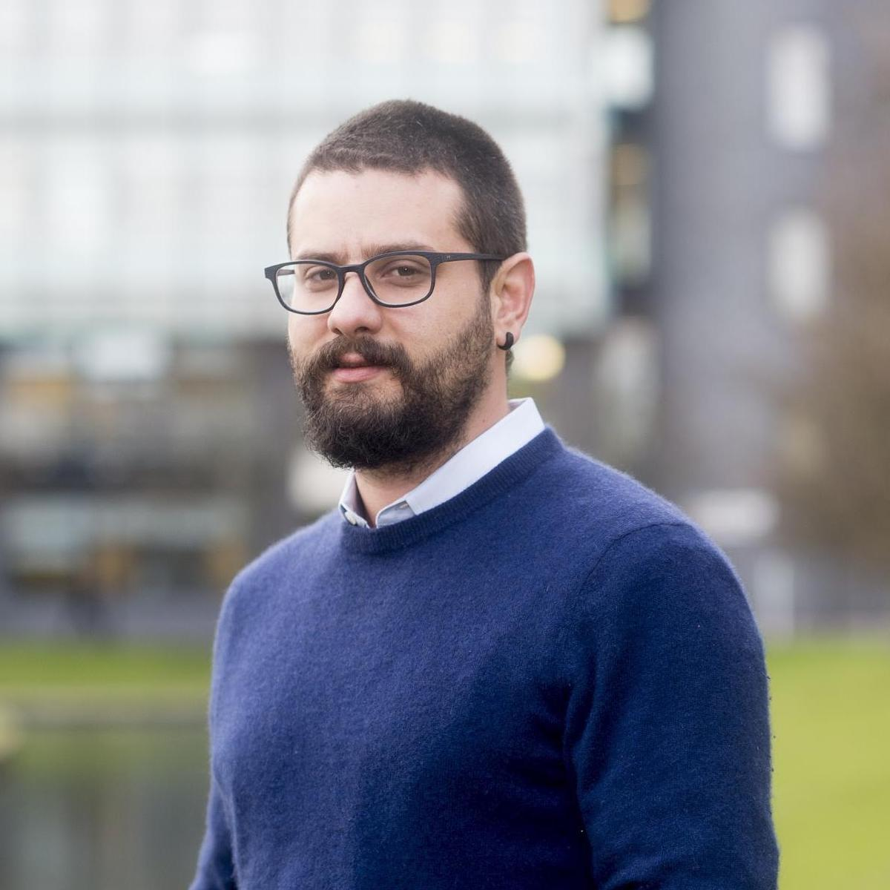
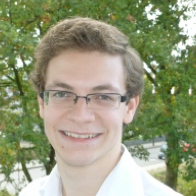

# Turing Reproducible Research Champions: Theo Damoulas

Theo's project is based around the paper *Spatio-temporal Bayesian On-line Changepoint Detection with Model Selection*, which describes an algorithm for detecting changepoints in data from spatio-temporal processes.
The algorithm has a very wide range of applications, so our focus on reproducibility of the results in the paper is also very relevant to encouraging use of the algorithm by the wider scientific community.

Jeremias Knoblauch and Theodoros Damoulas (2018) *Spatio-temporal Bayesian On-line Changepoint Detection with Model Selection*, to appear in Proceedings of the 35th International Conference on Machine Learning 2018.
Available at [arXiv:1805.05383](https://arxiv.org/abs/1805.05383) [stat.ML].

## Collaborators

Theo's PhD student, Jeremias Knoblauch, led the development of the algorithm.

 | 
:-----------------------:|:---------------------------:
 Theo Damoulas           | Jeremias Knoblauch

## Reproducible Research Q&A with Theo

**Can you give us a brief overview of your paper?**

We develop probabilistic algorithms for modelling and predicting non-stationary processes (such as e.g. air pollution, financial or other urban processes) across spatio-temporal domains.
This specific family of algorithms can be thought of as segmenting a complex dynamic process via more manageable local models.
Furthermore, we better exploit spatio-temporal correlation and retain multiple models and multiple potential segmentations in a formal probabilistic manner.

**Why is reproducible research important in your specific field?**

Reproducible research is important for every scientific field as it is at the core of the scientific method.
In our case we develop (machine learning) algorithms and demonstrate/apply them to real world data while comparing with the previous state of the art.
Hence, it is crucial for the community to be able to reproduce the research findings, apply our algorithms to new problems and further advance the field by developing even better algorithms that outperform ours in some or all aspects.
It is a natural cycle of good reproducible research that helps quickly advance our field.

**How will making the research presented in your paper reproducible help increase its impact?**

By allowing the community to utilize our algorithms, apply them to different problems and further extend them while being able to validate and reproduce our research findings.
